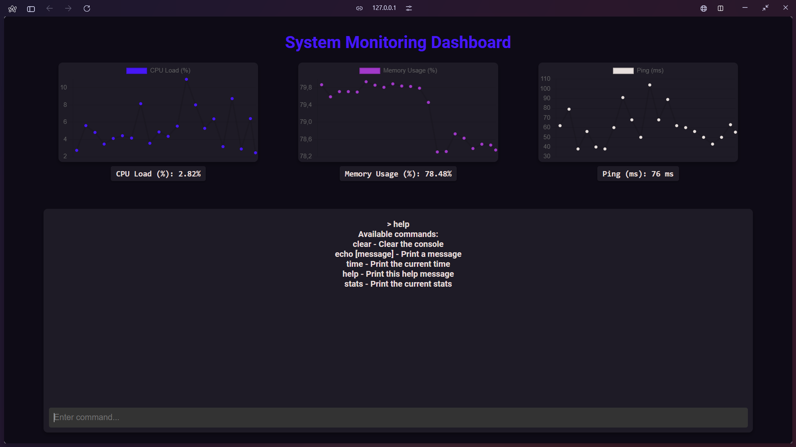

# sysmonitoring

[Documentation](https://sheita.gitbook.io/sysmonitoring)



**sysmonitoring** is a lightweight open-source and easy-to-use npm module for real-time system monitoring. It provides detailed insights into system performance, such as CPU, RAM, and program latency, in an intuitive and modern dashboard interface.

## Features

- Real-time system stats
- CPU, RAM, and program latency monitoring
- Customizable and user-friendly interface
- Live charts and graphs for easy data visualization
- Command-line style console for executing custom commands

- V1.1.1
    - Light/Dark mode 🌞/🌙
    - Redirect API calls if they're incorrect
    - Minor fix

## Installation

To install **sysmonitoring**, run the following command in your project directory:

```bash
npm install sysmonitoring
```
## Example

```javascript
const MonitoringDashboard = require('sysmonitoring');

// Create a new monitoring dashboard instance
const monitor = new MonitoringDashboard({
    port: 3000, // Port number (optional)
    showCpuLoad: true, // Show CPU load in the dashboard (optional)
    showMemoryUsage: true, // Show memory usage in the dashboard (optional)
    showPing: true, // Show network ping (optional)
    refreshInterval: 1000 // Refresh interval for stats (optional)
});

// Start the server to serve the monitoring dashboard
monitor.startServer();

// Example: Stop the server after 30 seconds
setTimeout(() => {
    monitor.stopServer(); // Stops the monitoring server
    console.log('Server stopped');
}, 30000);
```

